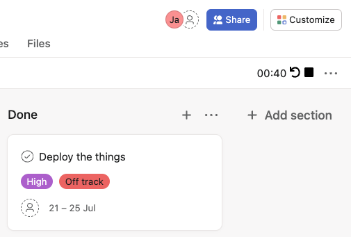

# Asana Standup Extension

Chromium extension that automates Standup in Asana by adding a convenient 1-minute timer to the top toolbar.

## Installation

Currently only manual installation is supported:

1. Clone this repo somewhere
2. In your chromium-based browser, navigate to `chrome://extensions`.
3. Click the "Developer mode" toggle button so that it is enabled.
4. Click "Load unpacked".
5. Select the dir where you cloned this repo.

The timer will automatically appear on any project viewed from `app.asana.com`.

## Updates

Manual for now.

1. `git pull origin main` this repo.
2. Go back to `chrome://extensions`
3. Click reload on the Asana Standup Extension.
